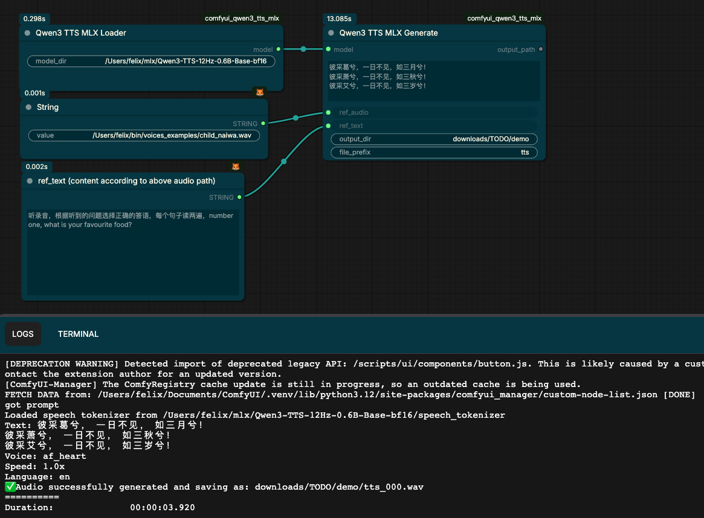

# ComfyUI-Qwen3TTS-MLX

ComfyUI custom nodes for Qwen3 text-to-speech using Apple MLX backend.

This project targets for Apple sillicon chips only, easy steps for comfyui string(multiline) to audio(.wav) files generation.

[Qwen3-TTS](https://huggingface.co/collections/mlx-community/qwen3-tts)

